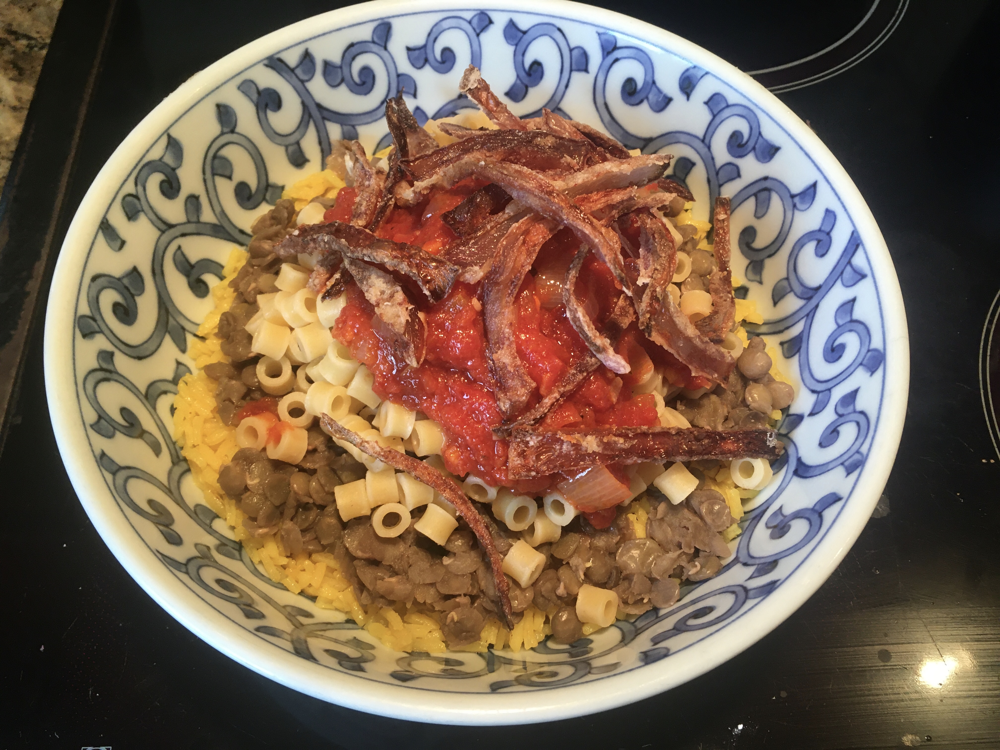
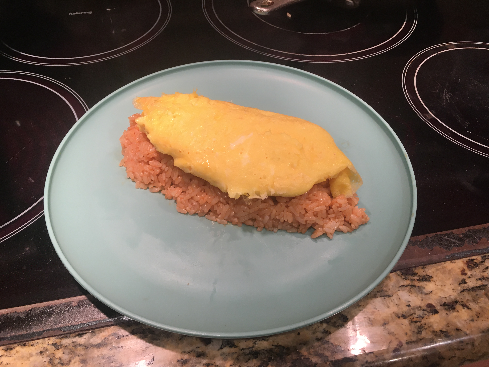

# Welcome 

*to my user page*

## Table of Contents

1. [Me](#me)
    - [Programming languages I am familiar with](#programming-languages-i-am-familiar-with)
    - [Experience](#experience)
2. [Some food I've made](#some-food-ive-made)
3. [Future plans](#future-plans)
4. [Quotes](#quotes)

## Me

This is what I look like:


I am a fourth year student at UCSD, majoring in Math-Computer Science. I have been interested in both math and computer science from a young age. Among my earliest programs, from age 11, is a Visual Basic script file that takes two numbers and an operator and outputs the result:
```
DO
op=inputbox("operator")
if op = "quit" then Exit Do
n1=inputbox("number 1")
n2=inputbox("number 2")
if op = "+" then msgbox n1-n2*-1
if op = "-" then msgbox n1-n2
if op = "/" then msgbox n1/n2
if op = "*" then msgbox n1*n2
Loop
```
(I don't remember why it uses `n1-n2*-1` to add the numbers.)

### Programming languages I am familiar with

- Python
- C
- C++
- Java
- SQL

### Experience

I have been an intern with the Research Experience for Undergraduates (REU) program at the [Center for Applied Internet Data Analysis (CAIDA)](https://caida.org/) since June 2022.

## Some food I've made



This is a batch of [koshari](https://en.wikipedia.org/wiki/Koshary) that I made recently. It was quite good. 



This is my most recent attempt at [omu-rice](https://en.wikipedia.org/wiki/Omurice). It's not perfect, but it's getting there.

## Future plans

- [ ] Graduate college
- [ ] Get a job
- [ ] Get my own place

## Quotes

> Meow

-- [my cat, Simon](other_images/simon.png)